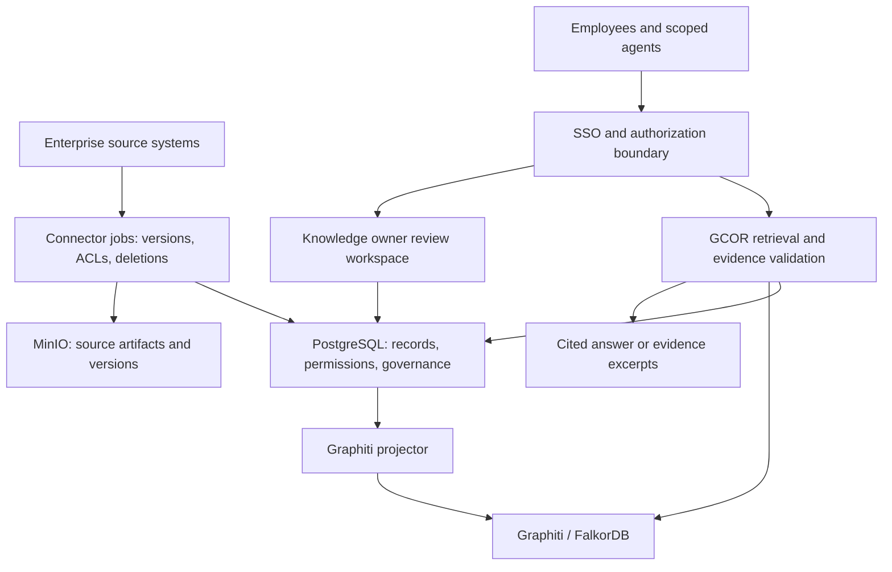

# Enterprise knowledge platform assessment

> Historical assessment: its external-source and SSO assumptions are superseded. The confirmed objective is knowledge generated inside Buzz through human–AI collaboration, using Buzz/Nostr identities. Follow [the corrected objective](collaborative-knowledge-objective.md) and [current implementation evidence](enterprise-workflows.md); the inventory and gaps below describe the earlier assessment.

Assessment date: 8 September 2026. Scope: repository implementation, deployment definitions, existing verification evidence, and a read-only live container/projection check. This is an engineering assessment, not a security certification or a capacity benchmark.

Implementation follow-up: identity now uses Buzz's existing Nostr public keys and live channel memberships, per the revised plan. See [Buzz identity pilot](enterprise-pilot-setup.md) for implemented boundaries, deployment evidence, and remaining work; a separate enterprise identity provider is no longer required.

## Decision

The stack is a credible foundation for an enterprise knowledge platform. Retain PostgreSQL/pgvector, MinIO, GCOR, Buzz, and the rebuildable Graphiti/FalkorDB projection. Its present readiness is **controlled internal prototype**, with a path to a departmental pilot. It is not ready for unrestricted enterprise deployment or mixed confidential departments.

The principal investment is identity, knowledge quality, source synchronization, and operations. Adding larger models alone will not close these gaps. Start with a read-only policy/procedure and decision-history assistant for one department, using a bounded, approved corpus and named knowledge owners.

Assumptions: one enterprise with multiple permission domains; both human and agent consumers; existing enterprise identity provider and document systems. User count, corpus size, jurisdiction, hosting restrictions, budget, and service objectives remain unspecified. Roadmap gates below are proposed targets, not measured performance or delivery estimates.

## Current evidence

- All 12 long-running services are running. Ten have passing Docker health checks; the two projectors have no Docker health checks.
- Migration and initialization containers exited successfully. The Graphiti release gate now passes with zero pending, retryable, in-flight, or dead-letter records. The previous recovery retry has completed.
- PostgreSQL preserves normalized records and governance state; MinIO preserves original and normalized artifacts. Graphiti is rebuildable rather than the sole source of truth.
- Existing capabilities include hybrid vector/full-text retrieval, source references, session provenance, approval/supersession, durable governance publication, request budgets, restricted remote fetching, projection retry/reconciliation, monitoring definitions, and deployment safeguards.
- Recent recovery fixes passed 11 focused tests. Earlier functional and fault tests establish useful component behavior, but do not establish production load, enterprise authorization, retrieval quality, or disaster recovery objectives.
- Monitoring definitions and production overlays exist; their existence does not demonstrate an active monitored production deployment. The live inventory contains no observability-profile services.

## Readiness by capability

| Capability | Assessment | Required improvement |
| --- | --- | --- |
| Authoritative storage and provenance | Useful foundation | Coordinated backup, restore validation, retention, source version and permission history |
| Identity and authorization | Enterprise blocker | SSO, verified user/service identities, roles and source ACL enforcement on every access path |
| Business-system ingestion | Early | Durable connector jobs, incremental sync, permission changes, deletions, reconciliation |
| Retrieval and answer trust | Functional, unvalidated | Citation integrity, representative evaluation, abstention, ranking and multilingual evaluation |
| Temporal enterprise graph | Working projection | Authorized query orchestration, entity identity, provenance validation, extraction quality tests |
| Knowledge stewardship | Partial | Owners, review dates, conflict resolution, authority hierarchy, review workspace |
| Privacy and data lifecycle | Major gap | Classification, redaction where required, deletion propagation and retention exceptions |
| Reliability and recovery | Local baseline | End-to-end SLOs, active alerts, worker progress checks, off-host restore drills |
| Scale and availability | Unproven | Workload benchmarks, inference sizing, durable ingestion workers, resilient hosting |
| Employee experience | Chat and API foundation | Search/review portal, source inspection, feedback, accessible user journeys |

## Concrete implementation findings

1. **Shared credentials do not establish individual authority.** `proxy/main.py` verifies a stack secret while models accept `access_level`, `agent_id`, `approved_by`, and `changed_by`. Session listing accepts optional channel scope; session detail access is not backed by authenticated membership. `mcp-postgres-gcor/server.py` forwards requests using service credentials. Derive identity and permitted scope at the server boundary; record the verified actor. Separate reader, contributor, approver, connector, and recovery roles.

2. **Graph traversal has weaker boundaries than document retrieval.** `run_retrieval_query` filters initial document candidates by channel and optional approved state. Its recursive native-graph traversal does not enforce those same document filters, and filters nodes after traversal. Where cross-boundary edges exist, this creates a disclosure/traversal risk. Authorize seeds, every traversed edge/node, final results, and citations. Cover session APIs, recovery exports, object downloads, and direct Graphiti access too. Graph group IDs are partition identifiers, not authorization credentials.

3. **Citations are not yet a grounding guarantee.** `generate_grounded_answer` can use six chunks while `/api/ask` defaults to returning four citation records. It checks only whether a bracketed number exists and may append evidence references without validating claims. Use one stable evidence map for generation and response; reject unknown references and evaluate whether cited passages actually support claims. Return abstention or ranked excerpts when validation fails.

4. **The standard answer path is not a unified Graphiti retrieval path.** `run_retrieval_query` traverses PostgreSQL `gcor.edges`; Graphiti is exposed separately through MCP. `/api/ask` synthesizes from document chunks, not those graph results. Add an optional orchestrator that retrieves Graphiti facts, verifies their authoritative provenance and current permissions, and turns supported facts into evidence. Keep document-only search operational during graph outages.

5. **Approval defaults are permissive.** Retrieval treats missing `knowledge_state` as approved, and callers can request non-approved content. For enterprise answers, make trusted-state rules server-controlled and route uncertain legacy records to explicit review. Distinguish verified source material, a human-approved policy, and a model-inferred claim.

6. **Parsing and synchronization are narrow.** `extract_text` supports PDF text extraction and otherwise decodes bytes as UTF-8. Add tested format-aware parsing for the selected source systems, including Office files, tables, scanned PDFs/OCR, and page/section anchors. Do not silently index binary Office content as text.

7. **Production configuration can change data destination and embedding space.** The production overlay switches Graphiti from local inference to an external API and defaults to a different embedding dimension. Treat that as an explicit deployment decision. Maintain model/version/dimension metadata and rebuild a separate projection before switching traffic; never reuse incompatible vector indexes. External inference must follow the enterprise's data-handling decision.

8. **Healthy processes do not demonstrate service outcomes.** GCOR's Compose health check still calls `/health`, while richer readiness is separate. Worker progress, usable inference, queue age, source freshness, and end-to-end answer success need independent checks. The recovery controller's Docker socket is a privileged surface; constrain its engine access.

## Target design

Preserve the current component responsibilities and add an authenticated access boundary plus a durable ingestion layer.

Keep sessions as one knowledge container while adding explicit source objects, revisions, organizational ownership, effective dates, review dates, and stable entity identifiers. Enterprise policies, products, projects, customers, decisions, and procedures must remain addressable independently of the chat that introduced them. Preserve conflicting claims and their evidence until an authorized owner resolves them.

Use application authorization with PostgreSQL row-level security as defense in depth. The application role must not be a superuser or bypass-RLS role; table owners normally bypass RLS unless forced. Use transaction-scoped identity in pooled connections. Deny access when identity or ACL freshness cannot be established. Source revocation must invalidate cached results and graph-derived access as well as document search. See [PostgreSQL row security](https://www.postgresql.org/docs/17/ddl-rowsecurity.html).

For remote MCP consumers, implement resource-bound authorization, token audience validation, and minimum scopes; do not pass arbitrary upstream tokens through tools. See [MCP authorization specification](https://modelcontextprotocol.io/specification/2025-11-25/basic/authorization).

Treat retrieved text as untrusted evidence. Embedded instructions must not authorize tool calls, approvals, or external actions. Start agents with read-only capabilities; give mutation tools separate authorization and verified actors. Use risk assessment and measurable evaluation informed by the [NIST Generative AI Profile](https://www.nist.gov/publications/artificial-intelligence-risk-management-framework-generative-artificial-intelligence), without claiming conformity from this review.

## Implementation sequence and acceptance gates

| Order | Deliverable | Proposed acceptance gate |
| --- | --- | --- |
| 1 — Establish trust | SSO integration, principals/groups, document ACLs, scoped MCP, role-separated governance, graph filter repair | No unauthorized content or metadata in cross-department tests across HTTP, MCP, sessions, graph, exports and caches; forged actor fields cannot grant authority |
| 2 — Make answers testable | Stable citation map, source versions/anchors, explicit trusted-state policy, evaluation harness | At least 100 owner-reviewed questions including conflicts, stale sources, no-answer and adversarial cases; 100% valid citation references; proposed >=95% supported factual claims and >=90% retrieval recall@10 on this pilot set |
| 3 — Connect one source reliably | One read-only connector with durable jobs, checkpoints, retries, ACL sync and deletions | Replaying a sync creates no duplicate revisions; disconnect/restart resumes safely; source revocation is enforced within an agreed bound, initially target five minutes |
| 4 — Enable stewardship | Review workspace, named owners, review dates, correction history, feedback routing | Every pilot knowledge item has an owner and traceable source revision; superseded policy is excluded from current-policy answers; conflicts are visible |
| 5 — Prove operations | Active alerts, worker heartbeat/lag, load tests, coordinated off-host backups and restore drills | Proposed pilot targets: p95 search <2s, p95 answer <15s under an agreed workload; PostgreSQL/MinIO restored and graph rebuilt in isolation; initial RPO <=24h and RTO <=4h demonstrated |
| 6 — Expand safely | Additional connectors/departments, authorized graph-assisted retrieval, capacity and availability improvements | Re-run permission, retrieval, restore and load gates for each expansion; document-only fallback continues working during graph/inference degradation |

Quality and latency targets above are starting proposals. Agree dataset composition, concurrency, corpus size, measurement windows, and critical-query requirements before treating them as release gates. Passing a finite test set is evidence, not proof of universal absence of leaks or hallucinations.

## Safe rollout and fallback

Use additive schema migrations, versioned APIs, connector checkpoints, and feature flags. Preserve a private, explicitly scoped legacy service path during migration; do not make failed enterprise authentication fall back to a shared broad credential. Backfill permissions conservatively, compare authorized results in staging, and enable a limited user group first.

Maintain document retrieval when Graphiti is unavailable, and return source excerpts when generation fails. If embedding inference is unavailable, implement an explicitly tested lexical-only path; current hybrid retrieval requests embeddings before its database query and therefore does not already provide this fallback. Pause failed connectors while displaying last-successful-sync time. Rebuild new graph/embedding versions alongside existing ones and switch only after validation.

Keep Compose for development and the initial isolated pilot. Choose managed or replicated authoritative storage and redundant application deployment when agreed availability objectives require them. Do not introduce orchestration complexity before measuring workload. Benchmark the current CPU inference setup before purchasing accelerators or selecting external models.

## Recommended next increment

Implement the identity/permission boundary and citation-integrity fixes first, together with a small regression corpus. Then connect one selected source and build the owner review workflow. Success is an employee receiving a current, supported answer they are authorized to see, with a usable source link and a clear correction path.

Before implementation planning, confirm the first department/use case, identity provider, first source system, expected corpus/concurrency, data residency constraints, and named knowledge/service owners. These choices refine the design; they do not change the immediate authorization and citation priorities.
